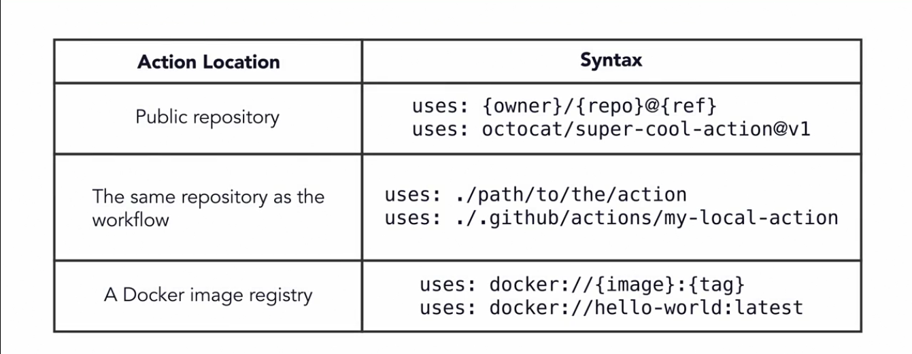
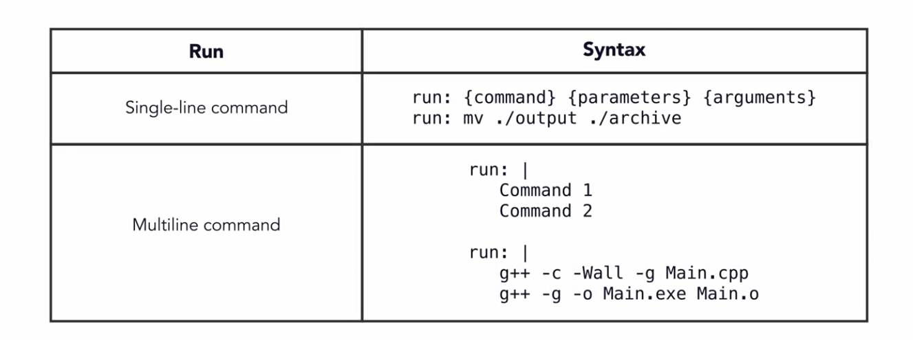

# Nootes

## Create a workflow
- Workflows define the event that triggers actions.
- Workflows define with actions to run.
- Repositories can contain multiple workflows.
- Workflows are stored in `.github/workflows`
- Is good practice to give workflow name that describe what the workflow does.
- Define the github event that will trigger the workflow using the `on` key word.

## Events
Most common events are:
- push
- pull_request
- release

You can use one or multiple events using brackets.
```
on: push
on: [push, pull_request]
```

## Jobs and steps
- Workflows must have at least one job.
- Each job must have a unique identifier.
- Job identifier must start with a letter or underscore.
- Jobs run in parallel by default.
- We need to specify the compute resource GitHub will use to run each job with `runs-on`
  - windows-latest
  - ubuntu-latest
  - macos-latest

## Steps
- Steps are tasks within a job.
- Steps run as process on the compute resource (ubuntu, windows, macos)
- Steps can run commands or actions.

## Adding an action
- `uses`: Execute an action in the operating system.
  

## Adding command to workflow
- `run`: Execute commands in the operationg system's shell.
- `bash`: Default shell for Ubuntu and macOS.
- `PowerShell`: Default shell for Windows.
  
